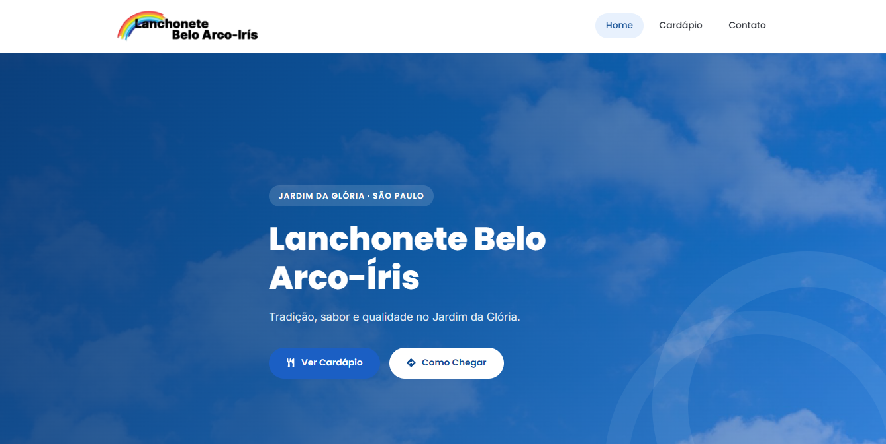

<p align="center">
  
</p>

<h1 align="center">Lanchonete Belo Arco-Iris</h1>

<p align="center">
  Site institucional desenvolvido com <strong>React</strong> e <strong>Vite</strong> para apresentar a Lanchonete Belo Arco-Iris, localizada no Jardim da Glória, em São Paulo.
</p>

<p align="center">
  
</p>

<p align="center">


</p>

---

# 📖 Sobre o projeto

O **Lanchonete Belo Arco-Iris** é um site institucional desenvolvido para apresentar uma das tradicionais lanchonetes da região do **Jardim da Glória**, em São Paulo.

O projeto foi pensado para oferecer uma experiência simples, moderna e intuitiva, permitindo que os clientes encontrem rapidamente as principais informações da lanchonete, como horários de funcionamento, localização, contato e cardápio.

A identidade visual foi inspirada nas cores do próprio cardápio da lanchonete, utilizando uma paleta clara composta principalmente por **azul**, **branco** e **preto**, transmitindo organização, confiança e profissionalismo.

---

# ✨ Funcionalidades

- 🏠 Página inicial institucional
- 🍽️ Apresentação da lanchonete
- ⭐ Seção com diferenciais
- 🕒 Horário de funcionamento
- 📖 Página exclusiva para o cardápio
- 🔍 Visualização ampliada das imagens do cardápio
- 📄 Download do cardápio em PDF
- 📍 Localização integrada ao Google Maps
- ☎️ Informações completas de contato
- 📱 Layout totalmente responsivo
- ✨ Animações suaves utilizando Framer Motion
- ⚡ Navegação rápida entre páginas utilizando React Router

---

# 📄 Páginas

## 🏠 Home

A página inicial apresenta a identidade da lanchonete através de um banner moderno e diversas seções institucionais.

### Conteúdo

- Hero com imagem de fundo
- Botão para visualizar o cardápio
- Botão "Como Chegar"
- Apresentação da lanchonete
- Diferenciais
- Horário de funcionamento
- Chamada para conhecer o cardápio

---

## 📖 Cardápio

Página dedicada ao cardápio oficial da lanchonete.

Recursos disponíveis:

- Cardápio frente
- Cardápio verso
- Zoom ao clicar
- Download em PDF

---

## 📍 Contato

Centraliza todas as informações necessárias para que os clientes possam visitar ou entrar em contato com a lanchonete.

Inclui:

- Endereço completo
- Telefone
- Horário de funcionamento
- Google Maps incorporado
- Botão "Como Chegar"

---

# 🎨 Design

A identidade visual foi construída seguindo o estilo do cardápio oficial da lanchonete.

### Paleta de cores

- 🔵 Azul (cor principal)
- ⚪ Branco (fundo)
- ⚫ Preto (textos)
- 🔘 Tons suaves de cinza

O objetivo foi transmitir um ambiente moderno, acolhedor e organizado, mantendo a tradição da lanchonete.

---

# 🚀 Tecnologias utilizadas

- React
- Vite
- React Router DOM
- Framer Motion
- React Icons
- CSS Modules

---

# 📂 Estrutura do projeto

```text
src/
│
├── assets/
│   └── logo.svg
│
├── components/
│   ├── About/
│   ├── CTA/
│   ├── Differentials/
│   ├── Footer/
│   ├── Hero/
│   ├── Hours/
│   ├── Lightbox/
│   ├── Navbar/
│   ├── PageTransition/
│   └── ScrollToTop.jsx
│
├── pages/
│   ├── Home/
│   ├── Menu/
│   └── Contact/
│
├── styles/
│   ├── global.css
│   └── tokens.css
│
├── App.jsx
└── main.jsx

public/
│
├── assets/
│   ├── hero-bg.jpg
│   ├── home.png
│   ├── about-photo.jpg
│   ├── cardapio-frente.svg
│   ├── cardapio-verso.svg
│   ├── cardapio-belo-arco-iris.pdf
│   └── favicon.svg
│
└── ...
```

---

# 💻 Como executar o projeto

## Clone o repositório

```bash
git clone https://github.com/seu-usuario/Lanchonete-Belo-Arco-Iris.git
```

## Acesse a pasta

```bash
cd Lanchonete-Belo-Arco-Iris
```

## Instale as dependências

```bash
npm install
```

## Execute o projeto

```bash
npm run dev
```

Depois, abra o endereço informado no terminal.

Normalmente:

```text
http://localhost:5173
```

---

# 📦 Build de produção

Gerar o build:

```bash
npm run build
```

Visualizar o build localmente:

```bash
npm run preview
```

---

# 📱 Responsividade

O projeto foi desenvolvido para funcionar perfeitamente em diferentes dispositivos.

Suporte para:

- Desktop
- Notebook
- Tablet
- Smartphone

A interface adapta automaticamente os componentes para diferentes resoluções, incluindo menu hambúrguer em dispositivos móveis.

---

# ⚡ Performance

Durante o desenvolvimento foram adotadas diversas otimizações para garantir uma navegação rápida e fluida.

Entre elas:

- Componentização em React
- CSS Modules
- Imagens otimizadas
- Cardápio em SVG
- PDF para download
- Lazy animations
- Código reutilizável
- Layout responsivo
- Navegação otimizada

---

# 📍 Informações da Lanchonete

**Lanchonete Belo Arco-Iris**

📍 Rua Inglês de Sousa, 305  
Jardim da Glória — São Paulo/SP  
CEP: 01546-010

☎️ (11) 3539-4944

🕒 Horário de funcionamento

**Segunda à Sexta-feira**

07:00 às 20:00

**Sábado e Domingo**

07:30 às 15:00

---

# 📸 Preview

<p align="center">
  
</p>

---

# 👨‍💻 Desenvolvedor

Desenvolvido por **José Diogo** como um projeto institucional utilizando React e Vite, com foco em performance, responsividade e uma experiência de navegação moderna.
- José Diogo - https://jose-diogo.vercel.app/

---

# 🧾 Cardápio em JSON

Todo o conteúdo do cardápio (pratos feitos, comerciais, pratos do dia, lanches, bebidas e porções) agora vive em `src/data/menu.json` — não é mais só a imagem escaneada, cada item existe como dado e é renderizado direto na página `/cardapio`.

**Como adicionar os preços:** abra `src/data/menu.json` e preencha o campo `price` de cada item com um número (ex.: `19.9`). Enquanto o campo estiver como `null`, o site mostra um travessão (`—`) no lugar do preço.

Estrutura do arquivo:

```json
{
  "categories": [
    {
      "id": "pratos-feitos",
      "title": "Pratos Feitos",
      "items": [
        { "name": "Picanha, Ovo, Arroz, Fritas e Salada", "price": null }
      ]
    },
    {
      "id": "bebidas",
      "title": "Bebidas",
      "subcategories": [
        { "title": "Sucos", "items": [ { "name": "Laranja", "price": null } ] }
      ]
    },
    {
      "id": "pratos-do-dia",
      "title": "Pratos do Dia",
      "days": [
        { "day": "Segunda-Feira", "items": [ { "name": "Picadinho", "price": null } ] }
      ]
    }
  ]
}
```

- Categorias simples (Pratos Feitos, Comerciais, Lanches, Porções) usam `items`.
- **Bebidas** usa `subcategories` (Sucos / Refrigerantes e outras bebidas) para separar os grupos.
- **Pratos do Dia** usa `days`, um array com o item do dia da semana.

Para adicionar um item novo, é só copiar o formato `{ "name": "...", "price": null }` dentro da categoria certa. Não precisa mexer em nenhum componente React — a página lê o JSON automaticamente e monta a seção, o menu de atalhos no topo e a formatação do preço (`R$ 19,90`).

As imagens originais do cardápio e o PDF continuam disponíveis mais abaixo na página, para quem preferir ver a arte tal como impressa.

## 📸 Fotos dos pratos

Qualquer item do JSON pode ganhar uma foto adicionando o campo `"image"` com o caminho do arquivo, por exemplo:

```json
{ "name": "Feijoada Prato Feito", "price": 35.00, "image": "/assets/menu/feijoada-prato-feito.jpg" }
```

As fotos ficam em `public/assets/menu/`. Na página do Cardápio existe um botão **"Ver com fotos"** — quando desligado (padrão), o cardápio aparece exatamente como antes, só texto e preço; quando ligado, todo item que tiver o campo `image` passa a mostrar a foto ao lado do nome. Itens sem foto continuam aparecendo normalmente mesmo com o botão ligado.

**Para adicionar novas fotos**, salve o arquivo em `public/assets/menu/nome-do-prato.jpg` e recomendo otimizá-la antes (fotos de celular costumam vir muito grandes, 3-5MB, o que deixa o site lento). Um jeito rápido:

- Redimensione para no máximo ~900px de largura (não precisa de mais que isso para o tamanho exibido no site).
- Recorte em proporção 4:3, se possível, para ficar do mesmo tamanho das outras fotos.
- Salve como `.jpg` com qualidade em torno de 75-80% — isso normalmente reduz o arquivo de alguns MB para menos de 100KB sem perda visível de qualidade.

Ferramentas online como [squoosh.app](https://squoosh.app) fazem isso de graça, sem precisar instalar nada — ou me manda a foto que eu otimizo e já devolvo pronta pra colocar no `menu.json`.

**Botão flutuante:** o "Ver com fotos" agora fica fixo no canto inferior direito da tela, sobre o conteúdo, e continua acessível mesmo rolando a página.

**Nova categoria "Porções à Parte":** adicionada logo abaixo de Comerciais no `menu.json` (Arroz, Feijão, Batata Frita Pequena e Salada), já com fotos. Os preços ficaram como `null` — é só preencher quando definir os valores.

## 🖼️ Carrossel do salão (Home)

A foto ao lado de "Sobre a Lanchonete" na Home virou um carrossel automático (`src/components/Carousel`), alimentado por `src/data/fotosDoEstabelecimento.json`. Ele passa as fotos sozinho a cada ~4,5s, mas também dá pra navegar pelas setas ou pelos pontinhos.

**Para adicionar mais fotos do salão** (por exemplo, amanhã):

1. Salve o arquivo em `public/assets/salao/salao-3.jpg` (siga a numeração).
2. Adicione uma entrada em `src/data/fotosDoEstabelecimento.json`:
   ```json
   { "src": "/assets/salao/salao-3.jpg", "alt": "Descrição da foto" }
   ```
3. Só isso — o carrossel detecta a nova foto automaticamente, não precisa mexer em nenhum componente.

Vale a mesma dica de otimização das fotos do cardápio: reduza pra no máximo ~1400px de largura e salve em `.jpg` com qualidade 75-80% antes de subir, senão fotos de celular (que costumam vir com vários MB) deixam o carregamento do site mais lento. Se preferir, me manda as fotos direto que eu já devolvo otimizadas.
